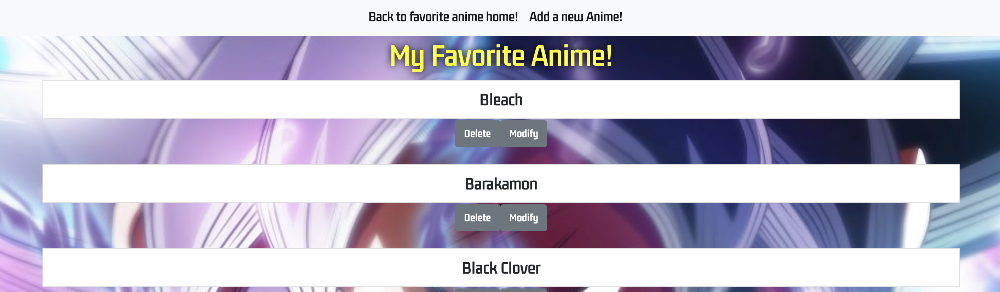
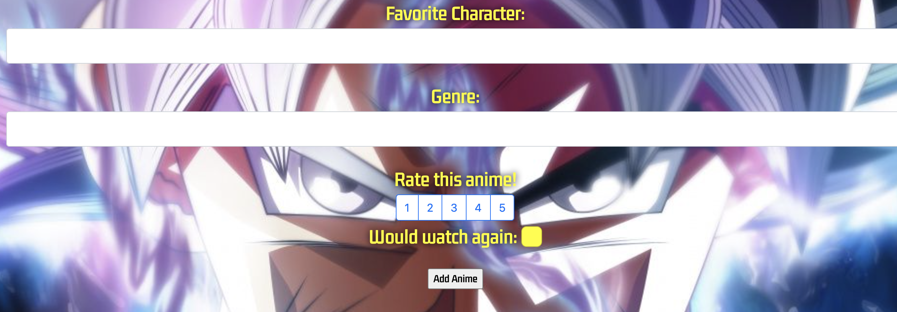
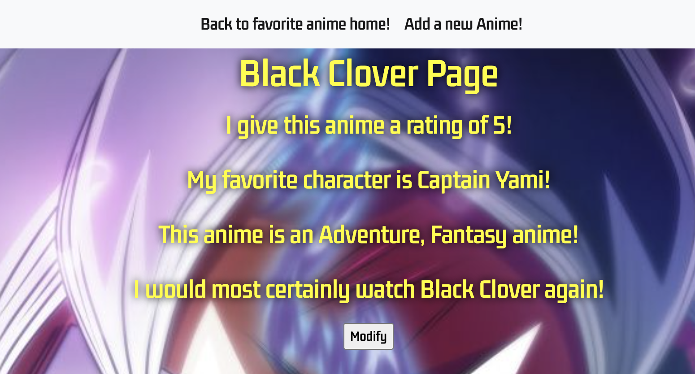

# Welcome to my Favorite Anime List APP!
This is my second project in my GA Software Engineering Immersive course! The app I chose to create is a website where you can store and share your favorite anime.

## App Description
My app is simple, you can add your favorite anime to the database and share what characters you liked, the genre that anime is, give the anime a rating and tell whether or not you would watch it again! There are is field to fill in the name of the anime. There is a field to fill in your favorite character in the anime. There is a field to fill in the genre of the anime. There are buttons to give the anime a rating of 1-5. There is a checkbox to show whether or not you would watch that anime again!

## Below is a few example pics of the app!

## User Stories
As a user I want to see my home list of my favorite anime with an option to go to a page for the anime I select. As a user I want the option to add, delete, or edit anime from my list. As a user I want to have a form to set attributes for my anime (example: name, rating, favorite character). As a user I want to be able to navigate around the site easily by having buttons or links to other pages on the site.

#### MVP Goals
Home page that can be populated with a list of favorite anime that can be edited or deleted. Adding new anime to the home page with a form for certain attributes. Option to delete anime from the list.

#### Stretch Goals
Have the site require a subscription/account to use. Have the site have an option to upload an image. Have the home page place the anime in order depending on the rating given to them.
